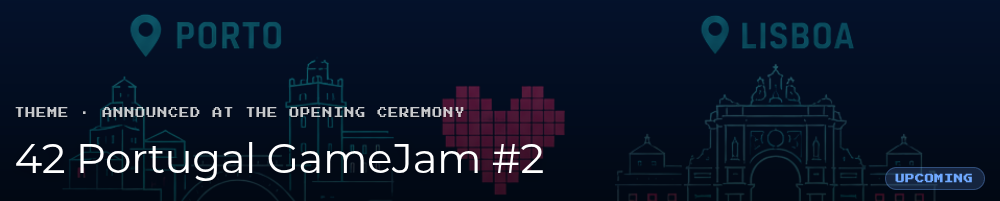

# 42 Portugal GameJam #2

**Event:** July 3–5, 2026  
**Theme:** TBA at Opening Ceremony (July 3rd, 20:00)

---

## Team

- [hcarrasq](https://github.com/Reyyyss)
- [diosoare](https://github.com/Diogo-Serra)
- [pbongiov](https://github.com/PedroLouzada)
- [psilva-p](https://github.com/Retr02k)

## Rules

- Teams of 1-4 members
- Game must run in a web browser (HTML export, `index.html` required)
- Theme application is mandatory
- AI-generated assets must be disclosed in the game description
- Only use assets you made or are legally allowed to use

## Stack

- **Engine:** Godot
- **Language:** GDScript

## Evaluation

| Criterion | Weight |
|---|---|
| Playability | 30% |
| Work Complexity | 15% |
| Originality | 20% |
| Artistic Style | 20% |
| Music & Sound | 10% |
| Judges' Criteria | 5% |

## Resources

- [Godot Documentation](https://docs.godotengine.org/en/stable/)
- [GDScript Documentation](https://docs.godotengine.org/en/stable/tutorials/scripting/gdscript/index.html)
- [How to make a Video Game - Godot Beginner Tutorial](https://www.youtube.com/watch?v=LOhfqjmasi0&t=459s)

---
42 Lisbon
